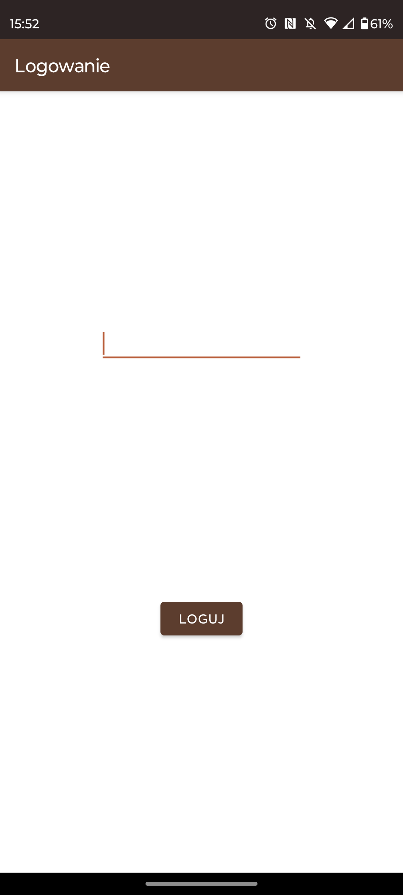
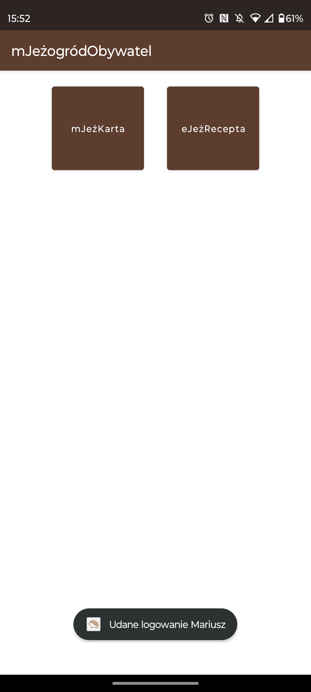
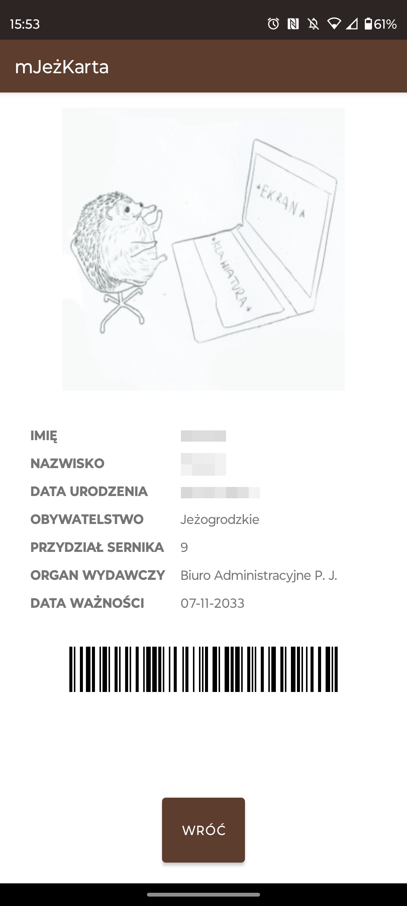
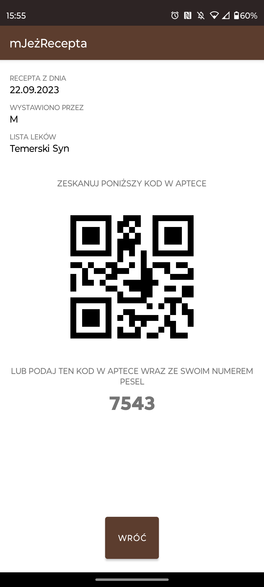

# mJeżogródObywatel

mJeżogródObywatel is a fun and lighthearted Kotlin-based mobile app that mimics the concept of a digital ID card (mObywatel). It was created as a playful joke for a barbecue gathering among friends who are members of the "Jeżogród" group and hold their own "Jeżogród IDs."

## Features

- **Digital Jeżogród ID Card**: Display your very own digital "Jeżogród ID card" complete with your name and photo, just like a real ID.
- **E-prescription**: Display humorous prescription with randomly generated QR codes.

    
    
    
    

## Authors:
[@majsterkovic](https://www.github.com/majsterkovic) & [@mpietr](https://www.github.com/mpietr)
